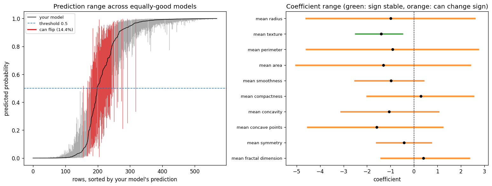

# rashomon-py

**Does your conclusion survive every equally-good model?**

You fitted a logistic or linear regression and you are about to report something from it: a coefficient's sign, a feature ranking, a decision for a particular person. But many other parameter vectors fit your training data essentially as well as the one your solver returned. If some of them would reverse your conclusion, the conclusion is a property of your optimizer's tie-breaking, not of the data. rashomon-py checks, in one call, on the scikit-learn model you already have.

```python
from sklearn.linear_model import LogisticRegression
from rashomon import audit

model = LogisticRegression().fit(X, y)       # your existing model (Pipelines work too)
report = audit(model, X, y)                  # pandas in -> feature names out

print(report.summary())
report.plot()
report.flipped                               # bool mask: rows whose prediction can flip
report.coefficients                          # DataFrame: estimate, low, high, sign_stable
```

On the ten "mean" features of the Wisconsin breast-cancer data, with sklearn's default `LogisticRegression()`:

```
Stability audit -- LogisticRegression (classification), n=569, 10 features
Equally-good models: training log-loss within 0.01704 of the optimum 0.1435
  (one standard error of the 5-fold cross-validated log-loss, whose mean is 0.1458; models closer than this cannot be told apart by CV)
Method: hit-and-run sampling of the exact set (with ellipsoid proposals); 2,000 models, min ESS = 387 -> reliable

Predictions (over the sampled models; true values can only be higher)
  Flip under some equally-good model:           14.4%  (82 of 569)
  Worst single-model disagreement with yours:    5.1%

Coefficients (exact range across all equally-good models)
  feature                  estimate        low       high  sign
  mean radius               -0.9976     -4.634      2.621  UNSTABLE
  mean texture               -1.399     -2.527    -0.4664  stable
  mean perimeter            -0.9124     -4.613      2.775  UNSTABLE
  mean area                  -1.298     -5.061      2.433  UNSTABLE
  ...
Sign stable: 1 of 10 features.
```



The model is 95% accurate, yet one in seven diagnoses would be reversed by some model that cross-validation cannot distinguish from it, and only *texture* has a coefficient whose sign every such model agrees on. Radius, perimeter and area are near-duplicates: the data pins down their combined effect, not how to split it between them. That is the kind of claim ("tumour radius lowers the odds") this tool exists to catch before it is published.

## Install

```bash
pip install rashomon-py          # Python 3.9+; depends on numpy, scipy, scikit-learn, pandas, matplotlib
```

## Isn't this just a confidence interval?

No, and the difference matters. A confidence interval or bootstrap answers: *if I drew a new sample from the population, how much would my estimate move?* rashomon-py answers: *on the data I actually have, how many different models fit about equally well, and do they agree with mine?* The first is sampling uncertainty; the second is **model multiplicity** (Breiman's "Rashomon effect"). A coefficient can have a tight confidence interval and still change sign across equally-good models when features are collinear, because the collinear directions are exactly the ones the loss barely sees. See [Bootstrap, Rashomon, and Bayesian intervals](docs/guide/why_not_bootstrap.md) for a worked comparison.

## What "equally good" means

Everything depends on the tolerance: how much worse than optimal a model may be and still count. `audit()` offers four ways to set it, and always prints the one in force:

| `tolerance=` | Meaning | When to use |
|---|---|---|
| `"cv"` (default) | one standard error of the cross-validated loss — models closer than this cannot be told apart by cross-validation (the one-standard-error rule from glmnet) | you want a data-driven default |
| `0.01` (any float in (0,1)) | models at most 1% worse than optimal on the training loss | you want a simple, explainable rule; `0.01`–`0.05` are common |
| `"lr"` / `("lr", 0.05)` | the models not rejected by a likelihood-ratio test at level α | unpenalized fits, statistical framing |
| `("absolute", 0.002)` | an explicit loss gap in training-loss units | reproducing a published setting |

The CV default is deliberately permissive — it reflects what your data can actually distinguish — so expect larger sets than with a 1% rule. Reporting results at two or three tolerances is more informative than any single one; see [Choosing the tolerance](docs/guide/choosing_epsilon.md).

## What you get, and what it is called in the literature

| `report.` | Plain meaning | Literature term |
|---|---|---|
| `flip_rate`, `flipped` | share (and mask) of rows whose predicted label changes under some equally-good model | ambiguity (Marx, Calmon & Ustun 2020) |
| `max_disagreement` | the most rows any single equally-good model disagrees with yours on | discrepancy (Marx et al. 2020) |
| `coefficients` | each coefficient's exact range across all equally-good models, and whether its sign is stable | variable importance cloud (Dong & Rudin 2020); hacking intervals (Coker, Rudin & King 2021) |
| `prediction_ranges` | per-row range of predicted probability / fitted value | prediction bands over the Rashomon set |
| `predict_ranges(X_new)` | the same for new rows, through your pipeline | — |
| `tolerance` | the loss gap defining the set | ε in the ε-Rashomon set (Fisher, Rudin & Dominici 2019) |
| `rashomon_set`, `samples` | the expert object and the sampled parameter vectors | — |

Coefficient ranges are **exact**: each is the solution of a convex program over the true set (automatically, when `n · d² ≤ 5·10⁶`; force with `exact_ranges=True`). Prediction-level numbers are computed over sampled models drawn from the exact set, so they are lower bounds that tighten as `n_samples` grows; the report states the effective sample size and whether it is reliable.

## Supported models

`LogisticRegression` / `LogisticRegressionCV` (binary; L2 or unpenalized; `class_weight=None`), `Ridge` / `RidgeCV`, `LinearRegression`, and a `Pipeline` whose last step is one of these. The regularization strength and the unpenalized intercept are converted exactly, and the audit checks that your fitted coefficients sit at the optimum of the reconstructed objective (a mismatch is reported, not hidden).

Not supported: multiclass (planned), L1 / elastic-net penalties (the Rashomon set of a non-smooth objective is not a convex level set in the same sense), trees, neural networks. The method relies on the loss being convex and twice differentiable, so other L2-penalized GLMs (Poisson, multinomial) are feasible extensions.

The useful regime is small to moderate dimension. Hit-and-run sampling mixes well up to a few dozen features; above ~60 features the report will tell you the effective sample size is low, and you should reduce dimension or sample much longer. Exact coefficient ranges do not depend on sampling and stay reliable.

## Expert API

`RashomonSet` exposes the machinery directly: ε calibration (`percent_loss`, `LR_alpha`, `absolute`), the membership oracle, exact hit-and-run sampling (optionally with ellipsoid proposals), the Hessian-ellipsoid approximation, exact `functional_range` / `coef_extremes`, model class reliance, Shapley-VIC, bootstrap and Bayesian comparisons. `RashomonSet.from_sklearn(model, X, y, ...)` builds one around a fitted model. Note that `RashomonSet(C=...)` is **not** scikit-learn's `C` (it is `1/λ` for the mean-loss objective; sklearn's `C` equals `C/n`) — use `audit` or `from_sklearn` to avoid the conversion.

```python
from rashomon import RashomonSet
rs = RashomonSet.from_sklearn(model, X, y, epsilon=0.02, random_state=0)
rs.functional_range(x_row)          # exact prediction range for one row, on the logit scale
rs.sample_hitandrun(2000, ellipsoid_mix=0.5)
```

## Documentation

- [Quickstart](docs/guide/quickstart.md)
- [When to use this](docs/guide/when_to_use.md)
- [Choosing the tolerance](docs/guide/choosing_epsilon.md)
- [Interpreting instability](docs/guide/interpreting_instability.md)
- [Bootstrap, Rashomon, and Bayesian intervals](docs/guide/why_not_bootstrap.md)
- [Ellipsoid approximation vs sampling](docs/guide/certificates_vs_sampling.md)
- [Tutorial: when equally-good models disagree](docs/examples/tutorial.md)
- [Evaluation on real datasets](docs/evaluation.md)
- [API reference](docs/api/reference.rst)

## References

- Breiman, L. (2001). Statistical modeling: The two cultures. *Statistical Science*, 16(3), 199–231.
- Fisher, A., Rudin, C., & Dominici, F. (2019). All models are wrong, but many are useful. *JMLR*, 20(177), 1–81.
- Marx, C., Calmon, F., & Ustun, B. (2020). Predictive multiplicity in classification. *ICML*.
- Dong, J., & Rudin, C. (2020). Exploring the cloud of variable importance for the set of all good models. *Nature Machine Intelligence*, 2, 810–824.
- Coker, B., Rudin, C., & King, G. (2021). A theory of statistical inference for ensuring the robustness of scientific results. *Management Science*, 67(10), 6174–6197.
- Rudin, C. (2019). Stop explaining black box machine learning models for high stakes decisions and use interpretable models instead. *Nature Machine Intelligence*, 1, 206–215.
- Semenova, L., Rudin, C., & Parr, R. (2022). On the existence of simpler machine learning models. *FAccT*.

## License

MIT
