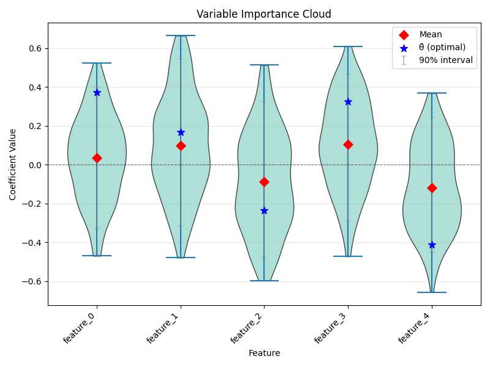
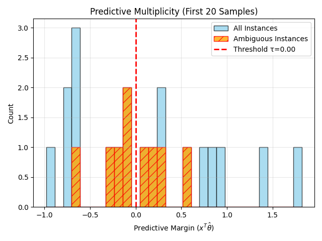

# Case Study: Robustness in Credit Scoring

In this tutorial, we apply **StableGLM** to a real-world credit scoring problem. We want to predict whether a loan applicant is a "bad" credit risk based on their financial history and demographics.

We use the **German Credit** dataset (UCI/OpenML ID 31).

## 1. Problem Setup

**Goal**: Predict default risk (`bad` credit).
**Key Questions**:
1.  Which features are *consistently* important for predicting default?
2.  How many applicants receive ambiguous decisions depending on the model choice?
3.  Are features like "Age" robustly predictive, or can they be ignored without loss?

```python
from sklearn.datasets import fetch_openml
from sklearn.model_selection import train_test_split
from rashomon import RashomonSet

# Load German Credit Data
data = fetch_openml(data_id=31, as_frame=True, parser="auto")
X = data.data
y = (data.target == 'bad').astype(float) # 1 = Default

# We focus on a subset of interpretable features:
# - checking_status (financial status)
# - duration (loan duration)
# - credit_history (past behavior)
# - age (demographics)
# - job (employment status)
```

## 2. Variable Importance Cloud (VIC)

We fit a logistic regression Rashomon set ($\epsilon=0.05$) and visualize the coefficients.



**Interpretation**:
- **Wide Intervals**: Notice that many coefficients have wide intervals crossing zero. This indicates that the optimal model's reliance on these features is *not stable*. You could find an almost-as-good model with a very different weight for `duration` or `age`.
- **Redundancy**: The fact that so many features can vary suggests the dataset has high redundancy—information is spread across many correlated variables.

## 3. Predictive Multiplicity (Ambiguity)

We examine the "ambiguity" of predictions for test set applicants.



**Interpretation**:
- **Ambiguity**: The vertical bars show the range of predicted probabilities.
- **Decision Flips**: Applicants with bars crossing the 0.5 threshold (red line) are "ambiguous". For these people, the decision to grant or deny credit depends entirely on which specific model from the Rashomon set you choose. This is a fairness concern.

## 4. Model Class Reliance (MCR)

We quantify the *range* of importance for each feature. Importance is measured as the drop in accuracy when the feature is permuted.

| Feature | Min Importance | Mean Importance | Max Importance |
| :--- | :--- | :--- | :--- |
| duration | 0.000 | 0.0003 | 0.027 |
| credit_amount | 0.000 | 0.0002 | 0.021 |
| age | 0.000 | 0.0003 | 0.028 |
| checking_status | 0.000 | 0.0002 | 0.024 |
| credit_history | 0.000 | 0.0003 | 0.030 |

**Key Insight**:
- **Min Importance = 0**: For almost every feature, there exists a "good" model that barely relies on it (importance ~ 0).
- **Distributed Signal**: This confirms that no single feature is a "bottleneck." The signal for credit risk is distributed. You cannot say "Age is definitely important" because there is a valid model where Age is irrelevant.
- **Rashomon Effect**: This is the essence of the Rashomon Effect in high-dimensional data. Many different explanations (models) account for the data equally well.
