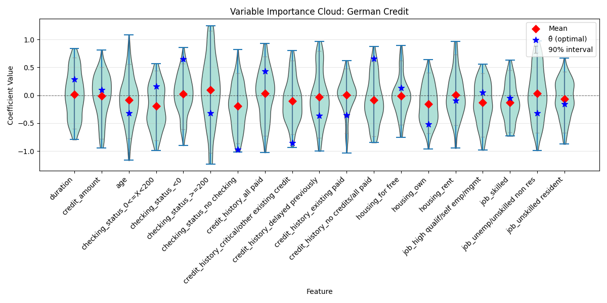

# Case Studies

We explore two datasets to demonstrate how StableGLM reveals different types of model stability.

## 1. Robust Signals: Breast Cancer Diagnosis

**Goal**: Classify tumors as Malignant/Benign using geometric features (Wisconsin Breast Cancer dataset).

```python
# ... (Code from previous example) ...
```

### Variable Importance Cloud (VIC)


**Interpretation**:
*   **Consistent Signals**: Features like `mean area` and `mean radius` are consistently important. While they can substitute for each other (collinearity), the model *always* needs geometric size info.

### Model Class Reliance (MCR)

| Feature | Min Importance | Mean Importance | Max Importance |
| :--- | :--- | :--- | :--- |
| mean radius | 0.040 | 0.058 | 0.076 |
| mean area | 0.072 | 0.094 | 0.118 |

**Key Insight**:
*   **Min Importance > 0**: Every feature is indispensable. You cannot remove `mean area` without hurting accuracy by at least 7%, even in the most robust model.

---

## 2. Redundant Signals: Credit Scoring

**Goal**: Predict credit default using the **German Credit** dataset (UCI ID 31).
**Context**: Financial data is often noisy, and many features (e.g., history, savings, job) carry overlapping information.

### Variable Importance Cloud


### Model Class Reliance (MCR)

| Feature | Min Importance | Mean Importance | Max Importance |
| :--- | :--- | :--- | :--- |
| checking_status_<0 | 0.002 | 0.018 | 0.035 |
| credit_amount | -0.009 | 0.002 | 0.016 |
| age | -0.008 | 0.006 | 0.017 |

**Key Insight**:
*   **Min Importance < 0**: For features like `age` and `credit_amount`, the minimum importance is negative. This means there exist "good" models in the Rashomon set for which permuting these features actually *improves* (or doesn't hurt) performance.
*   **Interpretation**: These features are **not robust**. While they might be useful in the optimal model, you can build an equally good model that effectively ignores them (or treats them as noise). This suggests the credit risk signal is weak or highly redundant.
