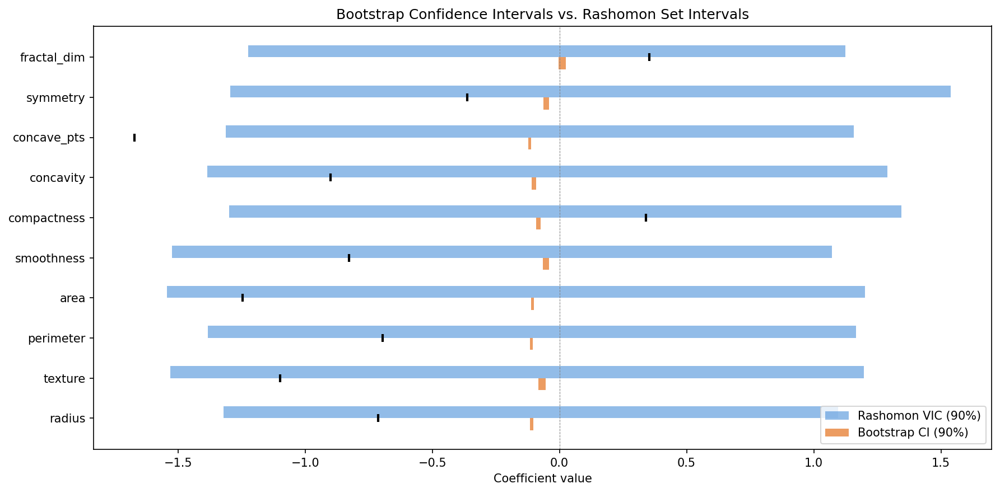
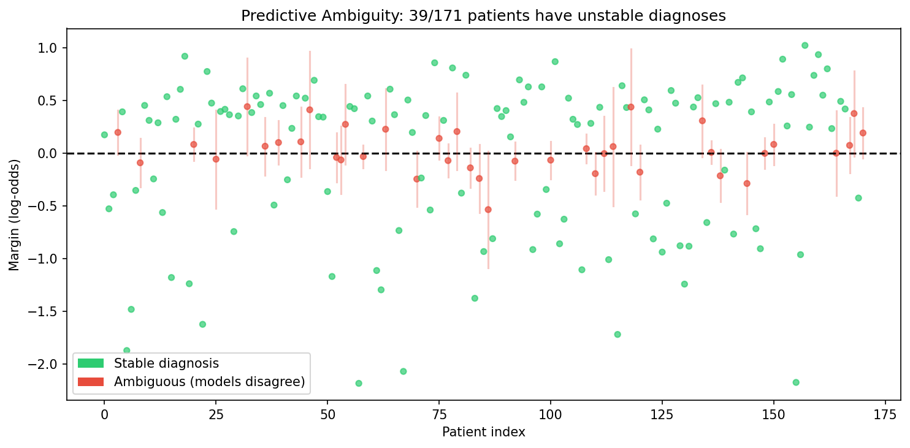
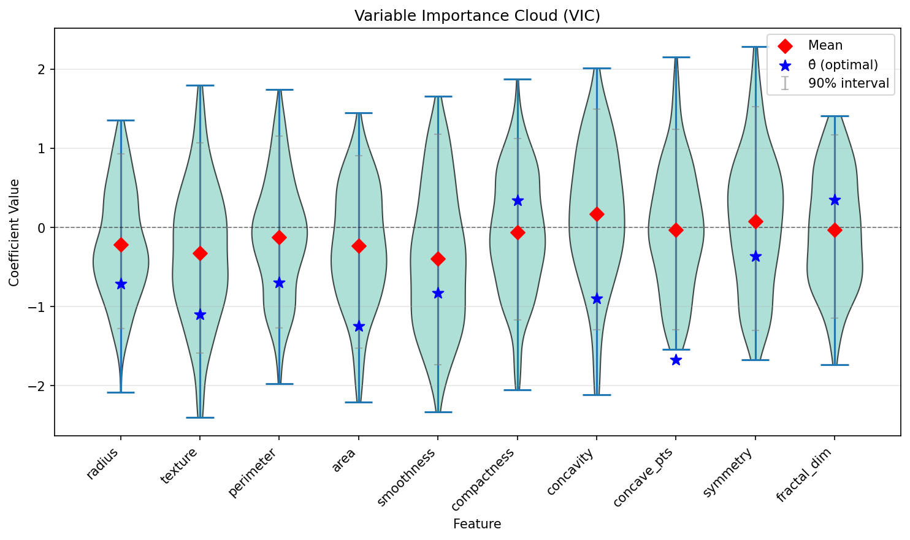
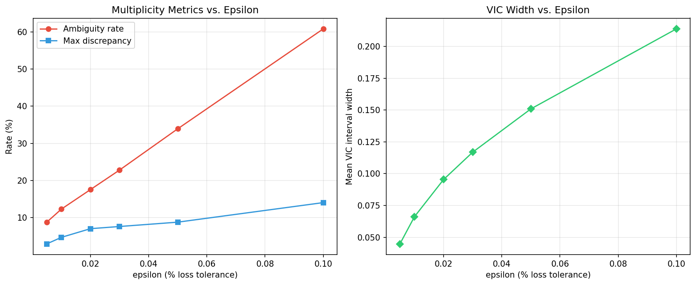

# Case Study: When Equally-Good Models Disagree

Standard model evaluation stops at accuracy. A logistic regression scores well on held-out
data, bootstrap confidence intervals are tight, and the model ships. But what if an
equally-accurate model gives a *different* prediction for 1 in 5 patients?

This case study demonstrates a concrete failure mode of single-model thinking using the
Wisconsin Breast Cancer dataset, and shows how Rashomon set analysis exposes instability
that bootstrap CIs and standard interpretability tools miss.

## Setup

We fit a regularized logistic regression to classify tumors as malignant or benign using
10 geometric features. The model uses L2 regularization and achieves strong predictive
performance. None of what follows is caused by a "bad" model.

```python
from sklearn.datasets import load_breast_cancer
from sklearn.preprocessing import StandardScaler
from sklearn.model_selection import train_test_split
from rashomon import RashomonSet

data = load_breast_cancer()
feature_names = ['radius', 'texture', 'perimeter', 'area', 'smoothness',
                 'compactness', 'concavity', 'concave_pts', 'symmetry', 'fractal_dim']
X = data.data[:, :10]
y = data.target.astype(float)

scaler = StandardScaler()
X_scaled = scaler.fit_transform(X)
X_train, X_test, y_train, y_test = train_test_split(
    X_scaled, y, test_size=0.3, random_state=42
)

rs = RashomonSet(
    estimator="logistic",
    epsilon=0.03,              # 3% loss tolerance
    epsilon_mode="percent_loss",
    sampler="hitandrun",       # exact membership sampling
    random_state=42,
    C=0.5,
    safety_override=True,
).fit(X_train, y_train)
```

## Part 1: Bootstrap CIs vs. Rashomon Intervals

The standard next step is to assess parameter uncertainty via bootstrap resampling.
StableGLM computes both bootstrap CIs and Rashomon set intervals in one call:

```python
comp = rs.compare_to_bootstrap(
    X_train, y_train,
    n_bootstrap=500,
    n_rashomon=500,
    confidence=0.90,
    feature_names=feature_names,
    random_state=42,
)
```

| Feature | Bootstrap 90% CI | Rashomon 90% Interval | Width Ratio |
|:--------|:----------------:|:---------------------:|:-----------:|
| radius | [-0.116, -0.103] | [-0.166, -0.055] | **8.5x** |
| texture | [-0.083, -0.055] | [-0.132, -0.015] | **4.1x** |
| perimeter | [-0.117, -0.104] | [-0.165, -0.053] | **9.2x** |
| area | [-0.112, -0.100] | [-0.174, -0.047] | **10.1x** |
| smoothness | [-0.066, -0.041] | [-0.119, -0.001] | **4.7x** |
| compactness | [-0.092, -0.074] | [-0.138, -0.019] | **6.3x** |
| concavity | [-0.110, -0.093] | [-0.158, -0.036] | **7.3x** |
| concave_pts | [-0.122, -0.112] | [-0.173, -0.058] | **10.7x** |
| symmetry | [-0.064, -0.040] | [-0.105, +0.019] | **5.2x** |
| fractal_dim | [-0.003, +0.024] | [-0.045, +0.056] | **3.7x** |



The Rashomon intervals are 4-11x wider than bootstrap CIs. These are not two estimates
of the same quantity. Bootstrap CIs answer: *"How uncertain are we about the best-fit
parameters given sampling noise?"* The Rashomon set answers: *"How many different
parameter vectors achieve loss within 3% of the optimum?"*

The gap between them is informative: for `concave_pts`, bootstrap says the coefficient
is known to within +/-0.005, but the Rashomon set contains models where it ranges from
-0.173 to -0.058 -- a 10.7x wider range. Note that `symmetry` has a VIC interval
crossing zero ([-0.105, +0.019]), meaning some near-optimal models assign it opposite sign.

**Important caveat.** The width ratio depends on both $\epsilon$ and $n$. Bootstrap CIs
shrink as $O(1/\sqrt{n})$ while Rashomon intervals for fixed $\epsilon$ do not. The ratios
reported here are specific to this dataset (n=398) and tolerance ($\epsilon$ = 3%). See the
[sensitivity analysis](#sensitivity-to-epsilon) below for how the results change with $\epsilon$.

## Part 2: Who Gets a Different Diagnosis?

Abstract instability becomes concrete when we ask which patients are affected.
**Ambiguity** measures the fraction of patients for whom some model in the Rashomon set
gives a different classification than the point estimate:

```python
amb = rs.ambiguity(X_test, threshold_mode="fixed", threshold_value=0.5)
print(f"Ambiguous: {amb['n_ambiguous']}/{len(X_test)} ({amb['ambiguity_rate']:.1%})")
# Ambiguous: 39/171 (22.8%)
```

39 out of 171 test patients receive a diagnosis that depends on which equally-good model
the clinician happens to use. For these patients, the margin interval straddles the
decision threshold -- meaning the prediction is not a property of the data alone,
but of the optimizer's particular solution.



Red points are patients whose margin intervals cross the decision boundary. Their vertical
bars show the range of predictions across equally-good models. Green points have stable
diagnoses regardless of which model is chosen.

**Discrepancy** measures worst-case pairwise disagreement:

```python
disc = rs.discrepancy(X_test, n_samples=200, n_pairs=200, random_state=42)
print(f"Max pair disagreement: {disc['max_pair_disagreement']:.1%}")
# Max pair disagreement: 7.6%
```

Two models that both achieve near-optimal loss can disagree on **7.6%** of test patients.

## Part 3: Which Features Are Substitutable?

The Variable Importance Cloud (VIC) shows the distribution of each coefficient across the
Rashomon set:

```python
rs.plot_vic(n_samples=300, feature_names=feature_names, random_state=42)
```



**Model Class Reliance (MCR)** computes the min and max permutation importance across
the Rashomon set (Fisher, Rudin, Dominici 2019):

```python
mcr = rs.model_class_reliance(
    X_train, y_train,
    n_permutations=20, n_samples=100,
    sampler="hitandrun", random_state=42,
)
```

| Feature | MCR- | Mean | MCR+ |
|:--------|-----:|-----:|-----:|
| radius | -0.006 | +0.024 | +0.050 |
| texture | -0.004 | +0.021 | +0.050 |
| perimeter | -0.005 | +0.022 | +0.054 |
| area | -0.006 | +0.019 | +0.047 |
| smoothness | -0.010 | +0.006 | +0.027 |
| compactness | -0.006 | +0.011 | +0.046 |
| concavity | -0.005 | +0.015 | +0.066 |
| concave_pts | -0.006 | +0.026 | +0.061 |
| symmetry | -0.009 | +0.002 | +0.017 |
| fractal_dim | -0.012 | +0.002 | +0.022 |

**Every feature has MCR- < 0 (or near zero).** For every feature, there exists a
near-optimal model where removing it does not hurt performance. No single feature is
indispensable. The features carry correlated information, and the optimizer's particular
decomposition into coefficient weights is one of many valid solutions.

(sensitivity-to-epsilon)=
## Sensitivity to Epsilon

The Rashomon set's size -- and therefore all derived metrics -- depends on the user-chosen
tolerance $\epsilon$. This is not a bug; it is the fundamental parameter of the analysis.
A practitioner must choose what "nearly as good" means for their application.

Here is how the key metrics change as $\epsilon$ varies from 0.5% to 10% loss tolerance:

| $\epsilon$ | Ambiguity | Max Discrepancy | Mean VIC Width |
|:----------:|:---------:|:---------------:|:--------------:|
| 0.005 | 8.8% | 2.9% | 0.045 |
| 0.010 | 12.3% | 4.7% | 0.066 |
| 0.020 | 17.5% | 7.0% | 0.095 |
| **0.030** | **22.8%** | **7.6%** | **0.117** |
| 0.050 | 33.9% | 8.8% | 0.151 |
| 0.100 | 60.8% | 14.0% | 0.214 |



All metrics grow monotonically with $\epsilon$. The choice of $\epsilon$ determines
the "bar" for what counts as a good model:

- **$\epsilon$ = 0.5%** (strict): Only models very close to the optimum. Even here,
  8.8% of patients have ambiguous diagnoses.
- **$\epsilon$ = 3%** (moderate): The tutorial default. A model that scores 97% as well
  as the best. 22.8% ambiguity.
- **$\epsilon$ = 10%** (permissive): A model that scores 90% as well. Majority of
  patients become ambiguous.

The $\epsilon$ that matters depends on the application. In medical diagnosis, a model
within 1% of the best is arguably "just as good." In credit scoring, the regulatory
tolerance may be larger.

## Implications

**For practitioners:** Even at a strict 0.5% tolerance, nearly 1 in 10 diagnoses is
unstable. At the moderate 3% level, it is 1 in 5. Standard evaluation (accuracy, CIs,
p-values) does not reveal this because it measures sampling uncertainty, not the
multiplicity of near-optimal solutions.

**For auditors:** The epsilon sensitivity table provides a concrete tool for regulatory
review. Rather than asking "is this model accurate?", ask "at what loss tolerance do
predictions become unstable for more than X% of the population?"

**For researchers:** The 4-11x width ratio between bootstrap CIs and Rashomon intervals
demonstrates that the two measure different axes of uncertainty. The ratio depends on
$\epsilon$ and $n$, but even at strict tolerances and moderate sample sizes, the gap
is substantive. The key question for a given application is not "how big is the ratio?"
but "is there ambiguity at a tolerance I consider acceptable?"
